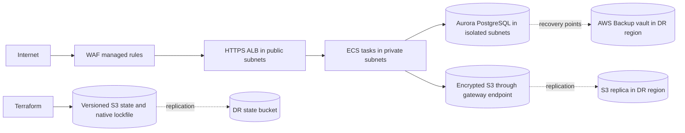

# Production web service on AWS

This configuration deploys an internet-facing web service on ECS/Fargate, an Aurora PostgreSQL backend, and a private S3 data bucket. Each environment is an independent Terraform root with its own backend, providers, inputs, lifecycle, and state. A shared composition module keeps workload orchestration consistent.

## Architecture



Production spans three availability zones. Each AZ has public, application, and isolated database subnets, and its own NAT gateway. Security groups permit only ALB-to-task traffic and task-to-database traffic. Tasks have no public IP.

## Repository layout

- `bootstrap`: creates the primary and replicated remote-state buckets and KMS keys.
- `environments/dev`: independent development root and state configuration.
- `environments/staging`: independent staging root and state configuration.
- `environments/prod`: independent production root and state configuration.
- `modules/webservice`: composes the workload modules and ECS task definition.
- `modules/network`: VPC, subnet tiers, routes, NAT gateways, flow logs, and S3 endpoint.
- `modules/security`: explicit ALB, task, and database trust boundaries.
- `modules/endpoints`: private AWS API endpoints and constrained application egress.
- `modules/storage`: application data, ALB logs, encryption, and replication.
- `modules/database`: Aurora, managed credentials, monitoring, and AWS Backup.
- `modules/service`: ECS, ALB, ACM, Route 53, WAF, IAM, autoscaling, and alarms.
- `scripts/validate.sh`: Terraform, security, lint, and FinOps validation for every environment.

## Prerequisites

- Terraform 1.10 or newer and AWS credentials supplied by workload identity or AWS SSO.
- A Route 53 public hosted zone for the service domain.
- An immutable Linux ARM64 container image, preferably an ECR URI pinned by digest. A multi-architecture manifest that includes `linux/arm64` is also supported.
- IAM permission to create the resources in both configured AWS regions.
- An organization CloudTrail that records management events and S3 data events for the workload and state buckets, with findings routed to the security account.

### Ownership boundaries

- Run `bootstrap` once for the shared backend, not once per environment. Dev, staging, and production use different object keys in the same state bucket. Run another bootstrap only for a separate AWS account or an intentionally separate backend boundary.
- The public hosted zone is domain-level infrastructure and is commonly shared by multiple services and environments. These roots accept its ID and create onlytheir ACM validation and service records, avoiding duplicate zones and conflicting name-server delegation. Manage the zone and registrar delegation in a platform or DNS root with a lifecycle independent of this workload.
- CloudTrail is an account or AWS Organizations security control. Creating one trailper workload environment duplicates management events, cost, and security policy. This stack therefore expects the organization trail listed above. In an account without that baseline, provision one account-wide, multi-region trail before the workload rather than adding it to each environment root.

## Environment policy

| Setting                         |    Dev | Staging |    Prod |
| ------------------------------- | -----: | ------: | ------: |
| Availability zones              |      2 |       3 |       3 |
| NAT gateways                    |      1 |       3 |       3 |
| Minimum ECS tasks               |      2 |       2 |       3 |
| Aurora instances                |      2 |       2 |       3 |
| Minimum Aurora capacity (ACU)   |    0.5 |     0.5 |       2 |
| Backup retention                | 7 days | 14 days | 35 days |
| Cross-region S3 and DB recovery |     No |      No |     Yes |
| Deletion protection             |     No |     Yes |     Yes |

## Validation and FinOps

Install and authenticate Terraform, TFLint, Checkov, Trivy, and Infracost, then run the complete validation stack from the repository root:

```bash
./technicalTest/scripts/validate.sh all
```

Pass `dev`, `staging`, or `prod` instead of `all` for a single environment. The script runs formatting, provider-schema validation, linting, security policy checks, and an Infracost scan using the matching checked-in example tfvars. It fails on critical Infracost diagnostics, unexpected recommendations, or these default monthly budget ceilings:

| Environment | Estimated baseline | Default ceiling | Override                               |
| ----------- | -----------------: | --------------: | -------------------------------------- |
| Dev         |               $137 |            $155 | `INFRACOST_DEV_MONTHLY_BUDGET`         |
| Staging     |               $250 |            $275 | `INFRACOST_STAGING_MONTHLY_BUDGET`     |
| Prod        |               $324 |            $350 | `INFRACOST_PROD_MONTHLY_BUDGET`        |

The shared state bootstrap is estimated separately at $2/month. These estimates are not a bill forecast: usage-based Aurora capacity, storage, requests, logs, NAT traffic, and internet transfer depend on actual traffic and retention. Rebaseline ceilings after an approved architecture or pricing change.

## GitHub Actions delivery

- `terraform-pr-plan.yml`: runs on PR creation and updates, executes Terraform formatting and validation, TFLint, Checkov, Trivy, and Infracost, then creates saved binary and human-readable plans for dev, staging, and production.
- `terraform-merge-apply.yml`: runs on each push to `main`, resolves the merged PR associated with that commit and the latest successful workflow for its exact head, verifies that the merged `technicalTest` tree matches the planned tree, and applies the saved plans without recalculating them. A direct push without an associated PR and reviewed plan fails closed.

Configure a branch ruleset for `main` in **Settings > Rules > Rulesets** (or an
equivalent classic branch protection rule):

1. Require a pull request before merging.
2. Require status checks to pass, selecting `Branch up to date`, `Validate infrastructure`, `Plan dev`, `Plan staging`, and `Plan prod` after those checks have run in the repository at least once.
3. Enable **Require branches to be up to date before merging** for the required status checks.
4. Block force pushes and branch deletion; include administrators when the repository's operating model requires the rule to have no bypass path.

The `Branch up to date` job provides an early, readable failure before validation and planning. The GitHub ruleset is still the enforcement authority: it marks old successful checks stale when `main` advances and prevents merging until the PR is updated and the workflow produces fresh plans.

Create `dev-plan`, `staging-plan`, and `prod-plan` GitHub Environments for PR plans. Each needs these variables:

- `AWS_PLAN_ROLE_ARN`
- `AWS_REGION`
- `DR_REGION`
- `DOMAIN_NAME`
- `HOSTED_ZONE_ID`
- `CONTAINER_IMAGE`

Configure them under **Settings > Environments > `<environment>-plan` > Environment variables**. Values differ by environment; for example, `DOMAIN_NAME` can be `dev.example.com`, `staging.example.com`, and `www.example.com`. The workflow maps them as follows:

| GitHub variable                | Terraform input                              | Workflow default       |
| ------------------------------ | -------------------------------------------- | ---------------------- |
| `PROJECT_NAME`                 | `TF_VAR_project_name`                        | `webservice`           |
| `AWS_REGION`                   | `TF_VAR_aws_region`                          | Required               |
| `DR_REGION`                    | `TF_VAR_dr_region`                           | Required               |
| `DOMAIN_NAME`                  | `TF_VAR_domain_name`                         | Required               |
| `HOSTED_ZONE_ID`               | `TF_VAR_hosted_zone_id`                      | Required               |
| `CONTAINER_IMAGE`              | `TF_VAR_container_image`                     | Required               |
| `ACTIVATE_DNS`                 | `TF_VAR_activate_dns`                        | `true`                 |
| `CONTAINER_PORT`               | `TF_VAR_container_port`                      | `8080`                 |
| `HEALTH_CHECK_PATH`            | `TF_VAR_health_check_path`                   | `/health`              |
| `DATABASE_SNAPSHOT_IDENTIFIER` | `TF_VAR_database_snapshot_identifier`        | `null`                 |
| `ALLOWED_INGRESS_CIDRS`        | `TF_VAR_allowed_ingress_cidrs`               | `["0.0.0.0/0"]`        |
| `ALLOWED_HTTPS_EGRESS_CIDRS`   | `TF_VAR_allowed_https_egress_cidrs`          | `[]`                   |
| `ALARM_EMAIL`                  | `TF_VAR_alarm_email`                         | `null`                 |
| `ADDITIONAL_TAGS`              | `TF_VAR_additional_tags`                     | `{}`                   |

Terraform automatically reads `TF_VAR_<variable_name>`. The five required workload inputs must be configured in each plan environment; all other GitHub variables are optional overrides. Encode lists and maps as Terraform expressions, such as `["203.0.113.0/24"]` and `{"Owner":"platform"}`. Use the literal `null` for an unset nullable value. The checked-in `terraform.tfvars.example` files are for local execution and documentation; GitHub Actions does not load them for real plans.

Create separate `dev`, `staging`, and `prod` GitHub Environments for applies. Each needs `AWS_APPLY_ROLE_ARN` and `AWS_REGION`. Restrict these environments to the `main` branch and configure required reviewers where appropriate, especially for production. Store `STATE_BUCKET_NAME` and `STATE_KMS_KEY_ARN` as repository-level variables, and store `INFRACOST_API_KEY` as a repository Actions secret.

Repository-level variables are configured under **Settings > Secrets and variables > Actions > Variables**. Configure `INFRACOST_API_KEY` on the adjacent **Secrets** tab. Environment variables override repository variables with the same name.

Both AWS roles use GitHub OIDC; no static AWS credentials are required. Give the plan role state read/lock and infrastructure read permissions. Give the apply role only the permissions needed to apply this stack. Its IAM trust policy must accept only the corresponding protected apply environment, not the `*-plan` environment.

Saved plans may contain sensitive values and are retained for one day. Applying the reviewed binary prevents a different plan from being generated after merge; it does not eliminate infrastructure drift. Terraform rejects the plan if its state snapshot became stale. Use separate scheduled drift detection for changes made outside Terraform. The workflows must first exist on the default branch before GitHub can trigger them for subsequent pull requests.

## Security and operations

- HTTPS uses an ACM certificate validated in Route 53; the ALB exposes no plaintext listener.
- WAF applies AWS common and known-bad-input rule groups plus per-IP rate limiting.
- IAM separates the ECS execution role from the application task role.
- Private interface endpoints carry ECR, CloudWatch Logs, and Secrets Manager traffic; external TLS egress is denied unless its CIDR is explicitly configured.
- The task role can access only the application bucket and its KMS key.
- RDS credentials remain in Secrets Manager and are injected at task startup.
- Every S3 bucket blocks public access, enforces TLS, and enables encryption.
- ALB access logs use SSE-S3 because ALB log delivery does not support SSE-KMS.
- Aurora enforces TLS, supports IAM authentication, is not public, and encrypts storage, credentials, snapshots, and Performance Insights.
- VPC flow logs, ALB access logs, PostgreSQL logs, Container Insights, and service alarms provide operational evidence. Confirm the SNS email subscription after apply.
- Production deletion protection and retained versions make destructive actions deliberate. Review every saved plan before applying it.

The design addresses automated recovery and observability, least privilege and layered controls, multi-AZ placement and rollback, autoscaling and Serverless v2, smaller non-production footprints, and managed/serverless services.

## Disaster recovery

Target objectives for production are an intra-region RPO near zero with an RTO of minutes, and a regional-disaster database RPO of at most 24 hours with an RTO of four hours. S3 replication is asynchronous and should be monitored separately; the database's continuous recovery points remain in-region while the scheduled recovery point is copied daily to the DR vault.

Run this drill at least quarterly:

1. Verify a recent recovery point exists in the DR AWS Backup vault, S3 replication is current, and the replicated state contains the latest state object version.
2. Create `backend-dr.hcl` in `environments/prod` from `backend.hcl.example`. Use the replica state bucket, replica KMS key, DR region, and a new key such as `webservice/prod-dr/terraform.tfstate`.
3. Create `prod-dr.tfvars` in `environments/prod` from `terraform.tfvars.example`. Set a unique `project_name`, set `aws_region` to the DR region, set `dr_region` to a third region, set `database_snapshot_identifier` to the copied cluster snapshot ARN, and set `activate_dns = false`.
4. In an isolated working copy, initialize with `-backend-config=backend-dr.hcl`, then plan and apply with `-var-file=prod-dr.tfvars`. This restores Aurora from the copied snapshot while building an independent three-AZ production stack.
5. Sync the existing S3 replica into the new stack's application bucket. Validate database migrations, object counts, task health, alarms, and the HTTPS endpoint using an explicit host-header test against the new ALB.
6. Set `activate_dns = true`, review the plan, and apply to move the Route 53 alias. Record the recovery point, object replication timestamp, and cutover time.

For failback, create a fresh recovery point and object copy in the original region, deploy and test there with DNS disabled, then switch the alias in a separate apply.
